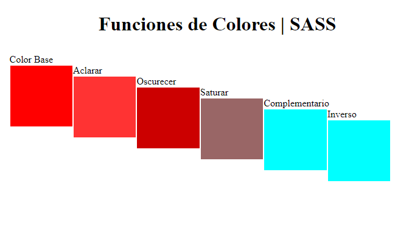

# Funciones de colores en SASS



```javascript
//Color Base
#uno
{
	background: $color-base;
}

//Claro
#dos
{
	background: lighten($color-base, 10%);
}

//Oscuro
#tres
{
	background: darken($color-base, 10%);
}

//Saturado
#cuatro
{
	background: desaturate($color-base, 80%);
}

//Complementario
#cinco
{
 	background: complement($color-base);
}

//Opuesto
#seis
{
	background: invert($color-base);
}
```

